# Recent project screen captures

Current UI from **this fork** (`Hitman90210/OrcSDR`), captured 2026-09-09 from
firmware `v0.2.0` at commit `fbe579d` on real hardware — an M5Stack Tab5.

These are separate from `docs/images/dashboards/`, which came from upstream and
predates the GMRS band, the channel scanner, and the weather channel picker.
Nothing here is a mockup or a render: the device draws each screen, screenshots
itself to its own SD card, and the file is pulled back over the serial link.

```powershell
python tools/screenshot_tab5.py home gmrs.radio wx.radio --mode demo --out shots
```

**About the red strip along the bottom.** These were taken in `demo` mode, which
stages representative content so a screen can be photographed without waiting
for a real transmission — so the firmware stamps `DEMO - STAGED CONTENT, NOT
LIVE RECEPTION` across the bottom edge. The layout, the controls, and the values
are the real UI; the signals are staged. Captures taken with a receiver attached
(`--mode live`) carry no such strip. The banner stays in rather than being
cropped out, because a screenshot that looks like live reception and isn't is
worse than a slightly busier image.

---

### Home dashboard
The workspace every band without its own dashboard runs on — last-used radios,
live spectrum and waterfall, tuning and volume.

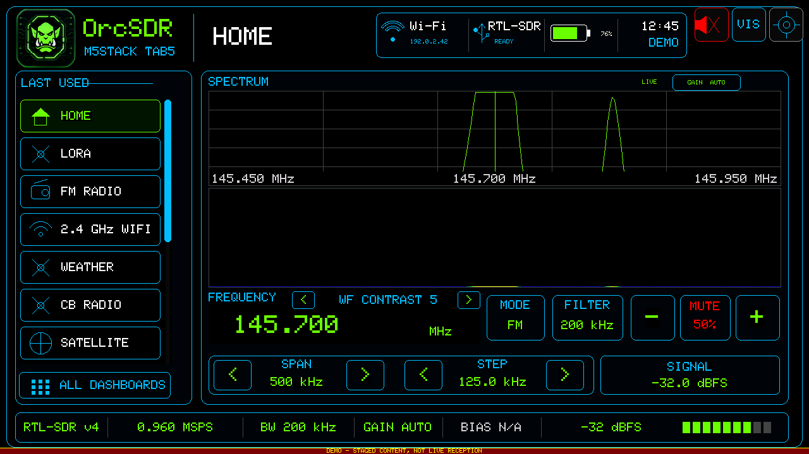

### All dashboards
The full navigation grid.

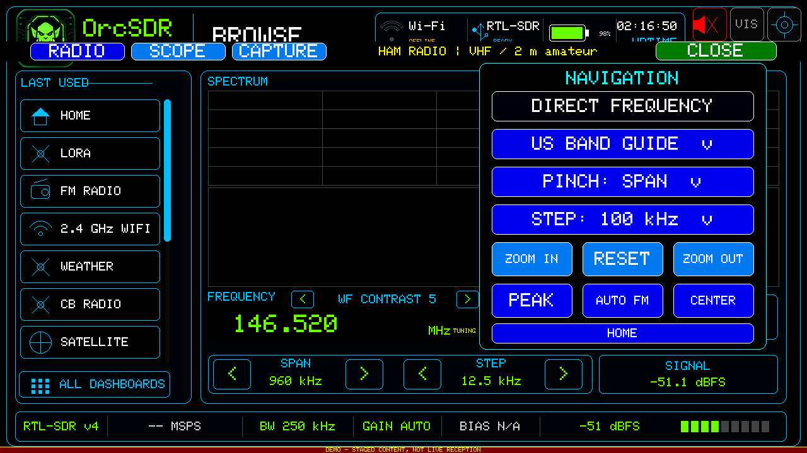

### GMRS / FRS — 30 channels with scanner
Channels 1–22 plus the R15–R22 repeater inputs. `SCAN` walks the channel list,
stops on a busy channel, and resumes about 2.5 s after it goes quiet.
Channels can be locked out so the sweep steps over them. Receive-only.

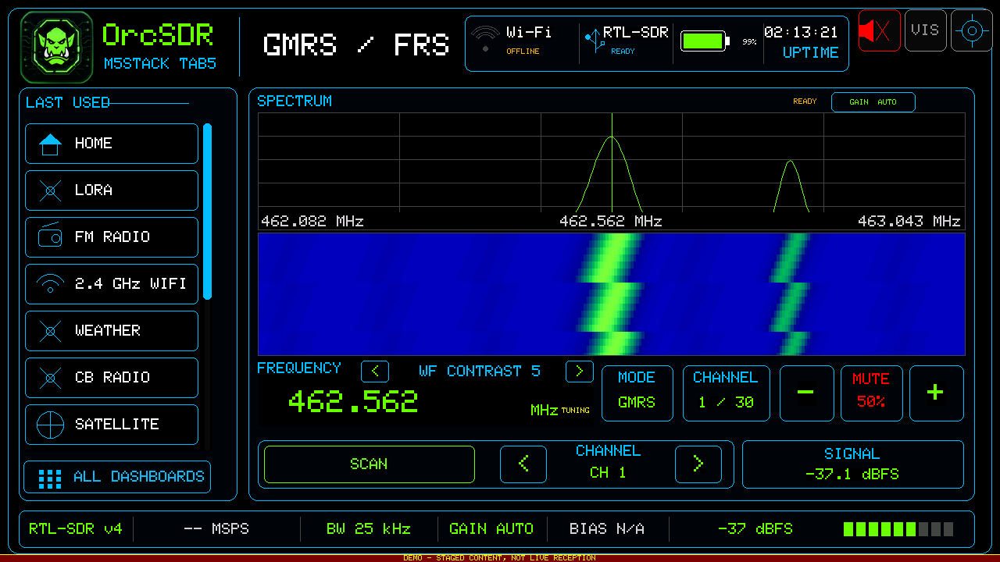

### CB radio — 40 channels with scanner
The standard 40-channel plan, AM/SSB, with the same scanner and a squelch that
also sets the scan's stop level.

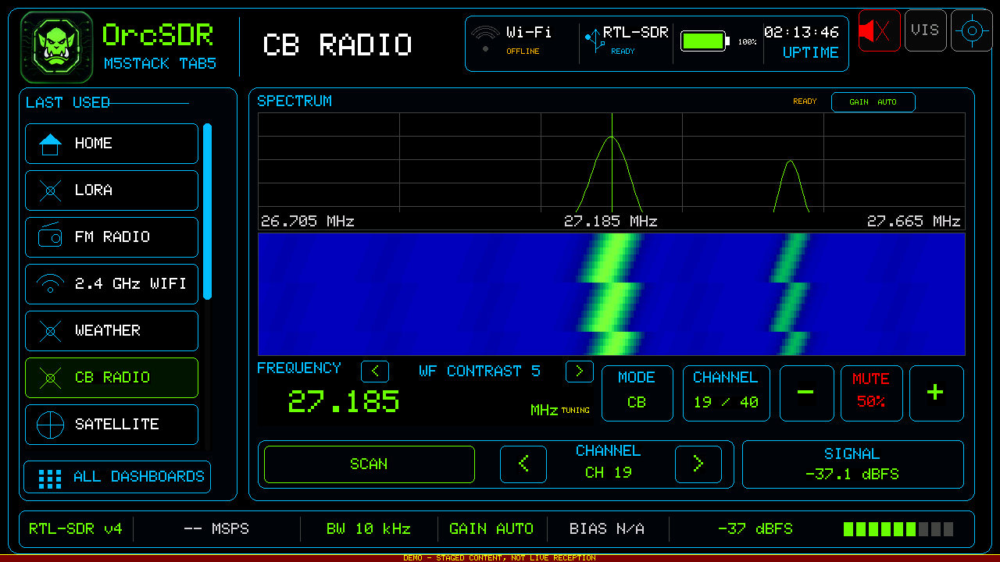

### NOAA weather — WX1–WX7 picker
All seven NWR channels as direct buttons, plus `SCAN`. No span or step controls:
the frequencies are fixed by regulation, so there is nothing to sweep.


### Marine VHF — 40 US channels with scanner
The US simplex working channels plus 16 (distress and calling), 13
(bridge-to-bridge), 09 (boater calling) and 22A (Coast Guard liaison).
Channel names keep their US "A" suffix, so 22A reads as 22A.

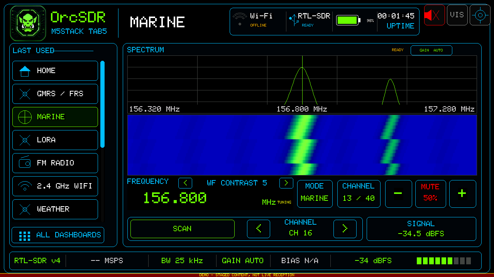

### FM broadcast — listen
Broadcast FM with stereo decode and a working band seek.

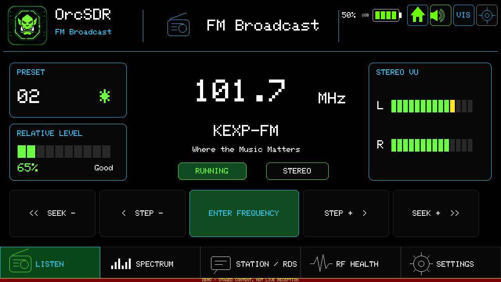

### FM — station and RDS
Station identity, RDS text, and the stereo/lock indicators.

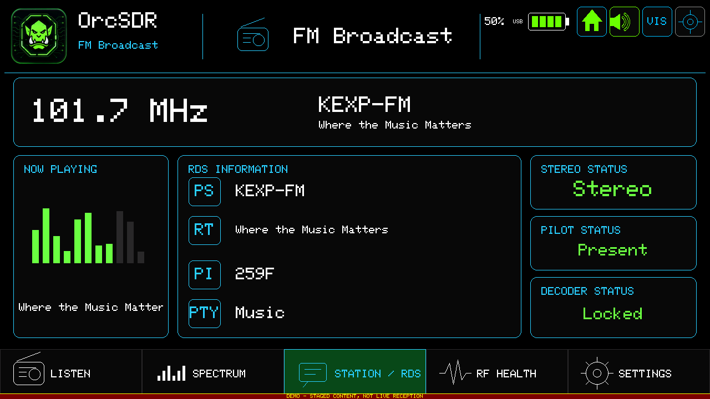

### P25 trunking monitor
Follows a programmed P25 system on a single tuner. Phase I voice decodes;
Phase II calls are detected and reported but not yet decoded.

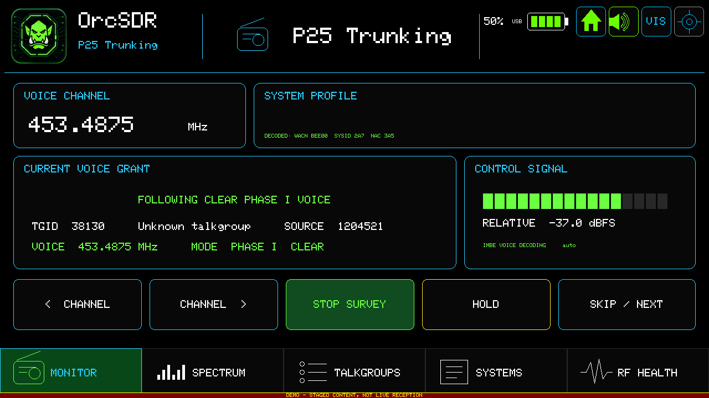

### LoRa / Meshtastic — overview
Receive-only Meshtastic monitor with selectable regional channels.

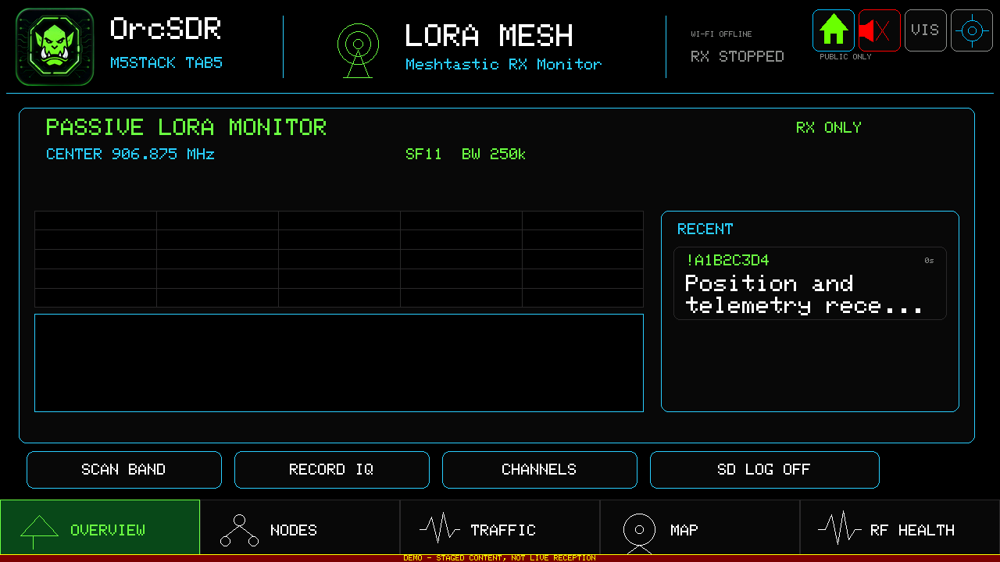

### LoRa — packet traffic
Decoded bursts as they arrive.

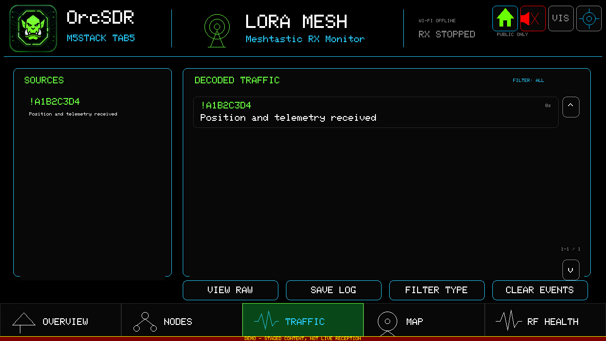

### LoRa — node map
Heard nodes plotted against the configured location.

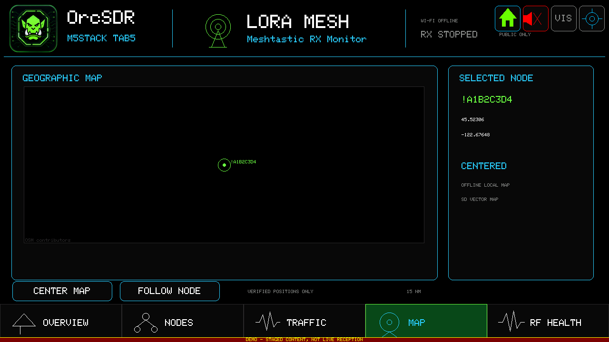

### Settings — data and maps
Downloadable data packs: aviation and aircraft databases, offline maps, ATC
presets.

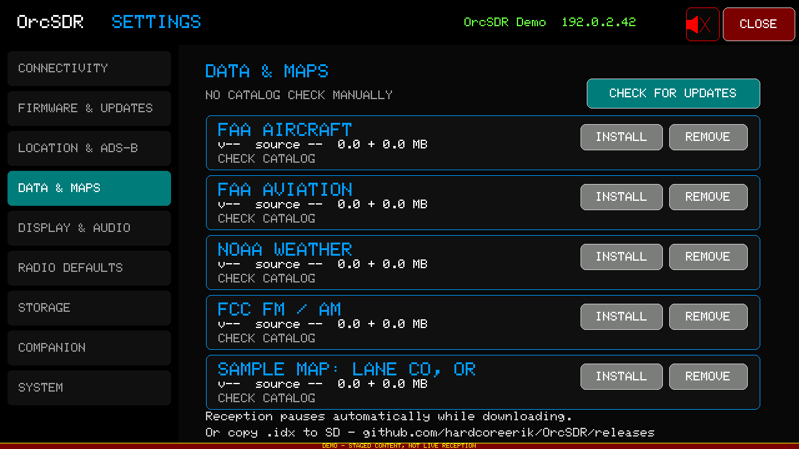

### Settings — location and ADS-B
Receiver location and ADS-B radar range. Location drives the offline map, the
nearest-ATC lookup, and P25 profile selection.

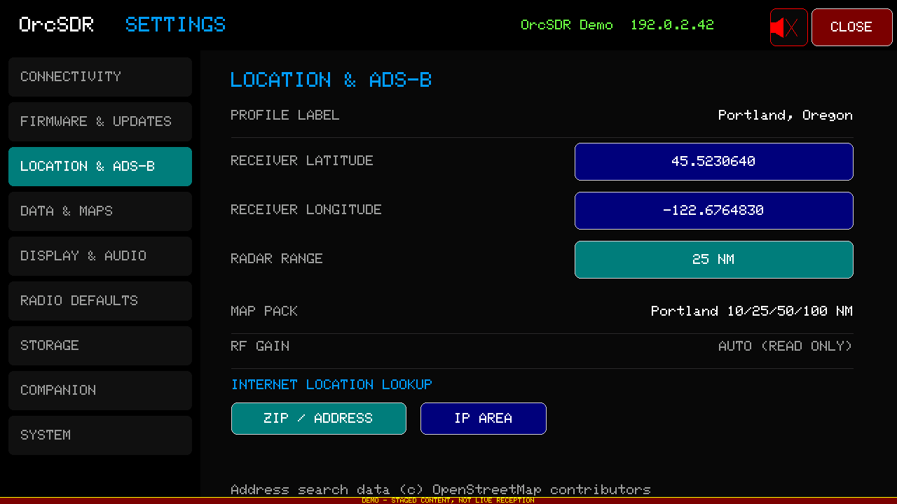

---

## Not captured here

- **ADS-B** and **POCSAG** are live-only — they need a receiver attached and
  actual traffic, so there is nothing meaningful to stage.
- The remaining `settings.*`, `overlay.*`, scope and capture views are all
  available; run `python tools/screenshot_tab5.py --list` to see the full set of
  47 documented screens.

## Refreshing these

With a receiver attached, `--mode live` produces banner-free captures with real
signals:

```powershell
python tools/capture_landing_dashboards.py --port COM3 --refresh
```

Note that SD transfers are refused while the receiver is running, so the tools
stop reception between writing each BMP and reading it back. The image is
already on the card at that point, so nothing about it changes.
